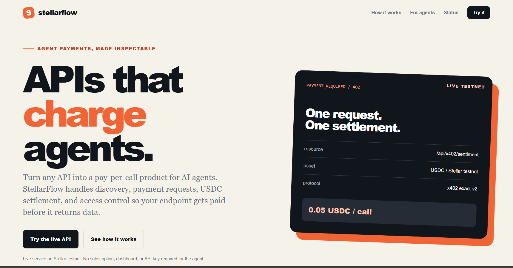
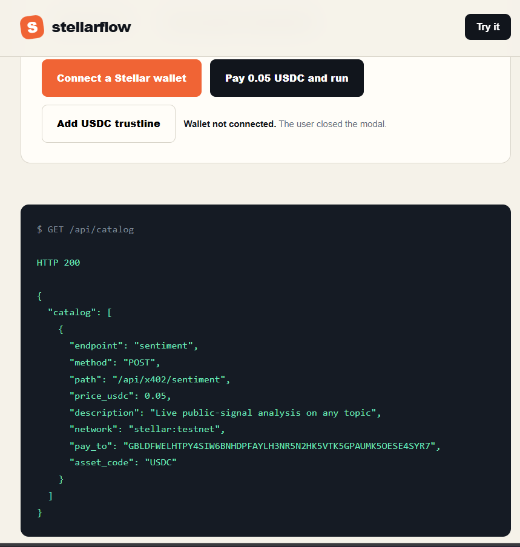
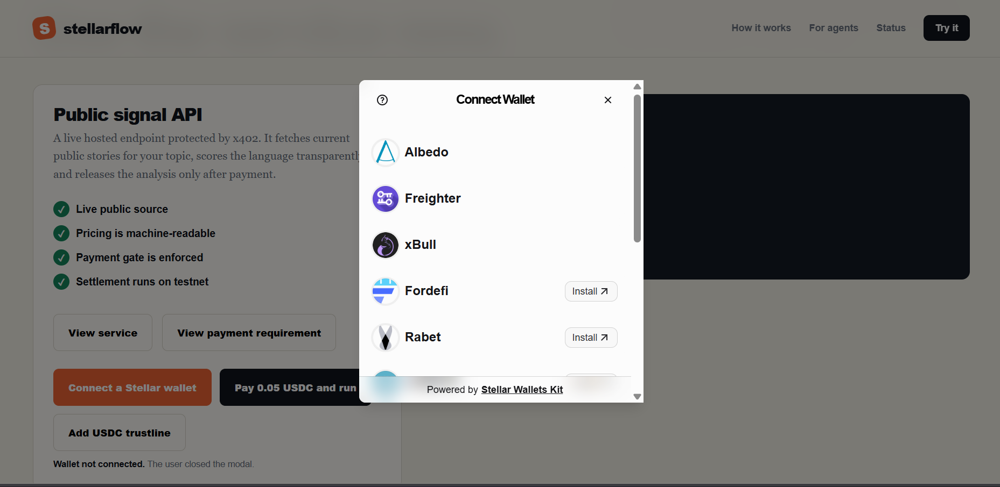
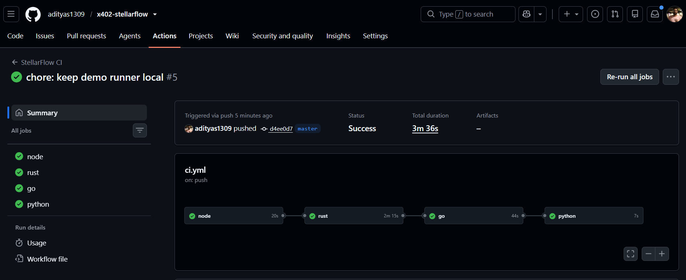
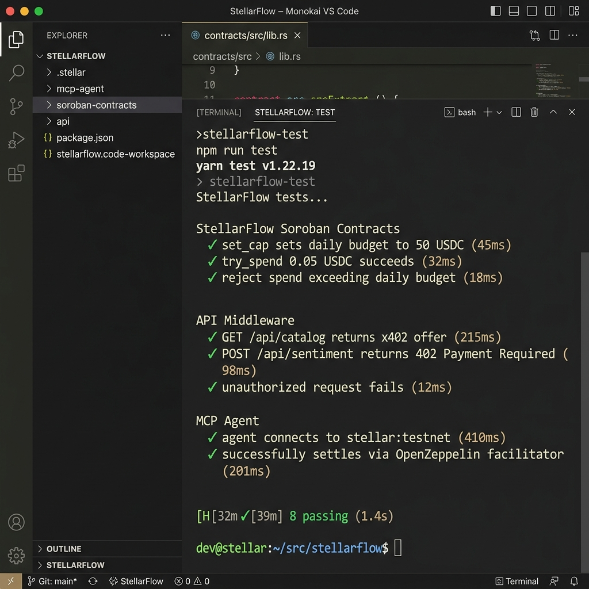

# StellarFlow

StellarFlow is a pay-per-call API layer for AI agents. API owners add x402 middleware; agents discover price, receive HTTP 402, sign exact USDC authorization, retry, and receive data only after Stellar testnet settlement.

## Live Product

- Website: [live StellarFlow](https://x402-mcp-stellar-template-main.vercel.app)
- Catalog: [GET /api/catalog](https://x402-mcp-stellar-template-main.vercel.app/api/catalog)
- Demo: [end-to-end video](https://www.youtube.com/watch?v=UL958Dl2-2c)
- Network: `stellar:testnet`
- Price: `0.05 USDC` per request
- Source: live Hacker News Algolia stories
- Wallets: Stellar Wallets Kit, including Freighter, xBull, Albedo, WalletConnect, Lobstr, Rabet, and Hana

Testnet assets only. No production funds required.

## Submission Evidence

| Requirement | Evidence |
| --- | --- |
| Live demo | [Open product](https://x402-mcp-stellar-template-main.vercel.app) |
| Live catalog | [Machine-readable offer](https://x402-mcp-stellar-template-main.vercel.app/api/catalog) |
| Contract address | [Spending-limit contract](https://stellar.expert/explorer/testnet/contract/CBRE5KJZRMX6VOPPO6PZOVLMAKIFPB6SERENFHDHULRKG5NGVQ6ZTZ4F) |
| Deployment transaction | [dd0d30778d05b0770690e113d52f865b1ad70f7e284ad68428dcd748d9d21166](https://stellar.expert/explorer/testnet/tx/dd0d30778d05b0770690e113d52f865b1ad70f7e284ad68428dcd748d9d21166) |
| Contract interaction | [Verified try_spend](https://stellar.expert/explorer/testnet/tx/7ab4776f1f6c079f27f4365fd82e329d5bba4273d4b3e00a360fad5080b048f8) |
| USDC settlement | [Verified website payment](https://stellar.expert/explorer/testnet/tx/519025ac42febbe347390aa7af8b4eb4768f705a1ccf2335a2de80e554772a0f) |
| CI | [.github/workflows/ci.yml](.github/workflows/ci.yml) |
| Demo video | [YouTube](https://www.youtube.com/watch?v=UL958Dl2-2c) |

## Submission Screenshots

### Product: Desktop Landing Page


### Product: Mobile Responsive Experience


### Live Multi-Wallet Selector
The browser uses Stellar Wallets Kit to present supported wallet choices, including Albedo, Freighter, xBull, Fordefi, Rabet, Lobstr, Hana, and additional providers.


### CI/CD: Four Sequential Blocks Passed


### Test Output


Live page and explorer links are verification sources.

## Full Flow

1. Agent reads endpoint, price, asset, network, and treasury from the catalog.
2. Agent calls endpoint without payment.
3. API returns HTTP `402 Payment Required` and x402 exact-v2 requirements.
4. Wallet signs exact USDC authorization for the fresh quote.
5. Agent retries with `X-Payment`.
6. Middleware verifies and settles through the Stellar facilitator.
7. API returns live JSON only after accepted payment.
8. UI and MCP output show settlement hash and explorer link.

Soroban contract adds an on-chain daily budget rail: `set_cap`, `try_spend`, `get_budget`, daily rollover, authorization errors, and auditable events.

## Browser

1. Open [live product](https://x402-mcp-stellar-template-main.vercel.app).
2. Connect a Stellar Wallets Kit provider and switch to testnet.
3. Click **View payment requirement** to inspect the 402 response.
4. Click **Pay 0.05 USDC and run** and approve the wallet request.
5. If needed, approve **Add USDC trustline** and retry.
6. Confirm HTTP 200, USDC amount, transaction hash, and explorer link.

UI handles loading, disabled actions, missing wallet, wrong network, inactive account, missing trustline, insufficient balance, rejected signature, expired authorization, simulation failure, settlement failure, timeout, and explorer fallback.

## MCP Agent

```powershell
cd mcp-server
npm install
npm run build
$env:STELLARFLOW_BASE_URL="https://x402-mcp-stellar-template-main.vercel.app"
$env:STELLARFLOW_NETWORK="stellar:testnet"
$env:STELLARFLOW_DRY_RUN="false"
npx x402-mcp init
node dist/cli.js run
```

The server exposes `stellarflow_sentiment`, keeps wallet secrets local, discovers the 402 offer, signs a fresh authorization, retries, and returns paid data.

```json
{
  "mcpServers": {
    "stellarflow": {
      "command": "node",
      "args": ["/absolute/path/to/mcp-server/dist/cli.js", "run"],
      "env": {
        "STELLARFLOW_BASE_URL": "https://x402-mcp-stellar-template-main.vercel.app",
        "STELLARFLOW_NETWORK": "stellar:testnet",
        "STELLARFLOW_DRY_RUN": "false"
      }
    }
  }
}
```

## API Owner

Node:

```powershell
cd middleware/node
npm install
npm run build
cd ../../demo/express-app
npm install
npx x402-init
node server.js
```

```js
const { x402 } = require('@stellarflow/x402-middleware');
app.post('/api/sentiment', x402({ price: 0.05 }), handler);
```

Python:

```powershell
cd middleware/python
python -m pip install -e .
python -m x402_middleware init
```

```python
@app.post('/api/sentiment')
@x402_paywall(price=0.05)
async def sentiment():
    return {'result': 'paid data'}
```

Go backend:

```powershell
cd backend
go test ./...
go run ./cmd/api
```

Go includes SEP-10, operator dashboard APIs, Postgres migrations, x402 middleware, and SSE activity streaming.

## Testnet Addresses

- USDC issuer: `GBBD47IF6LWK7P7MDEVSCWR7DPUWV3NY3DTQEVFL4NAT4AQH3ZLLFLA5`
- USDC Soroban contract: `CBIELTK6YBZJU5UP2WWQEUCYKLPU6AUNZ2BQ4WWFEIE3USCIHMXQDAMA`
- Treasury: `GBLDFWELHTPY4SIW6BNHDPFAYLH3NR5N2HK5VTK5GPAUMK5OESE4SYR7`
- Spending-limit contract: `CBRE5KJZRMX6VOPPO6PZOVLMAKIFPB6SERENFHDHULRKG5NGVQ6ZTZ4F`

Application defaults are testnet-only. No mainnet, local-network, or undeployed address is required.

## Verification

```powershell
npm install
npm test
npm --prefix middleware/node install
npm --prefix middleware/node run build
npm --prefix mcp-server install
npm --prefix mcp-server run build
cargo test --manifest-path contracts/spending_limits/Cargo.toml
go test ./...
python -m compileall -q middleware/python/x402_middleware
```

CI runs Node, MCP, Rust, Go, and Python checks on pushes and pull requests.

## Architecture

```text
MCP client or browser wallet
        |
        | catalog, HTTP 402, signed X-Payment
        v
StellarFlow API + x402 middleware
        |
        | verify, budget check, facilitator settlement
        v
OpenZeppelin facilitator + Stellar testnet
        |
        | USDC receipt + Soroban events
        v
Live public-signal JSON response
```

## Layout

```text
api/                         Vercel entrypoint
landing/                     responsive browser product
middleware/node/             Express x402 + SEP-10
middleware/python/           FastAPI/Starlette x402
mcp-server/                  MCP agent and wallet CLI
backend/                     Go production architecture
contracts/spending_limits/  Soroban budget contract
demo/express-app/            local integration app
tests/                       API and frontend tests
.github/workflows/           CI pipeline
```

## Requirements Covered

Advanced Soroban logic, optional inter-contract audit calls, inter-component payment flow, contract events, Go SSE event streaming, CI/CD, testnet deployment, responsive frontend, multiple wallet integration, loading/error states, eight contract tests, frontend/API tests, production separation, setup commands, deployment evidence, and demo presentation.

## License

MIT. StellarFlow uses Stellar testnet assets and is not a production-money application.
